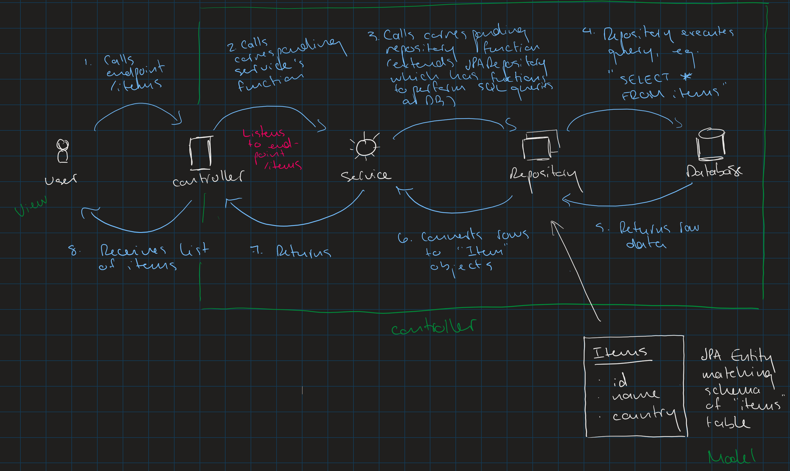

# Loqio Microservices Architecture

This document explains the microservice architecture of the Loqio language learning platform.  Each service has clear boundaries, responsibilities, and data ownership.

## Current Microservices

| Service | Purpose | Boundaries & Responsibilities | Technical Details |
|---------|---------|------------------------------|-------------------|
| **Hello World Service** | Demonstration microservice for learning microservice concepts | - Provides a simple REST endpoint<br>- Returns static "Hello, World!" response<br>- Serves as a template for new microservices | - **Port**: 8081<br>- **Database**: None (stateless service)<br>- **Endpoints**: `GET /` → "Hello, World!" |
| **Language Content Service** | Manages language learning content and vocabulary data | - Stores and retrieves vocabulary items<br>- Manages language content (Tagalog-English translations)<br>- Provides CRUD operations for vocabulary data<br>- Owns the vocabulary domain logic | - **Port**: 8082<br>- **Database**: PostgreSQL (vocabulary table)<br>- **Endpoints**:<br>  - `GET /` → "Hello, World!" (placeholder)<br>  - `GET /items` → List all vocabulary items |

## Language Content Service Components

### Database Connection Setup

The Language Content Service connects to Azure PostgreSQL using these configuration settings in `language-content-service/src/main/resources/application.properties`:

```
spring.datasource.url=jdbc:postgresql://${VOCABULARY_DB_HOST:localhost}:${VOCABULARY_DB_PORT:5432}/${VOCABULARY_DB_NAME:postgres}?sslmode=require
spring.datasource.username=${VOCABULARY_DB_USERNAME:postgres}
spring.datasource.password=${VOCABULARY_DB_PASSWORD:password}
```

- **JDBC URL**: Tells the service how to connect to its database
- **SSL Mode**: Ensures secure connection to Azure (required)
- **Environment Variables**: Service-specific database credentials loaded from `.env` file

## MVC Interactions in Language Content Service

In the Language Content Service, the Model-View-Controller (MVC) pattern is implemented as follows:

- **Model**: The data entities (Language, Module, Sentence) and their corresponding repositories (LanguageRepository, ModuleRepository, SentenceRepository) that handle database interactions.
- **View**: The JSON responses returned by the controller endpoints, representing the data in a format suitable for client consumption.
- **Controller**: LanguageContentController handles incoming HTTP requests, delegates business logic to services, and formats the responses.

Interactions:
1. A client sends an HTTP request to a controller endpoint (e.g., GET /languages).
2. The controller receives the request and invokes the appropriate service method (e.g., languageService.getAllLanguages()).
3. The service executes business logic and interacts with the repository to query or manipulate model data in the database.
4. The service returns the model objects (e.g., List<Language>) to the controller.
5. The controller serializes the model objects into JSON and returns them as the HTTP response (view).

This separation ensures clean architecture: the controller manages request/response handling, services encapsulate business logic, and models represent the data structure and persistence.


